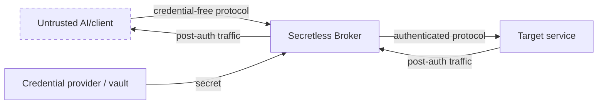
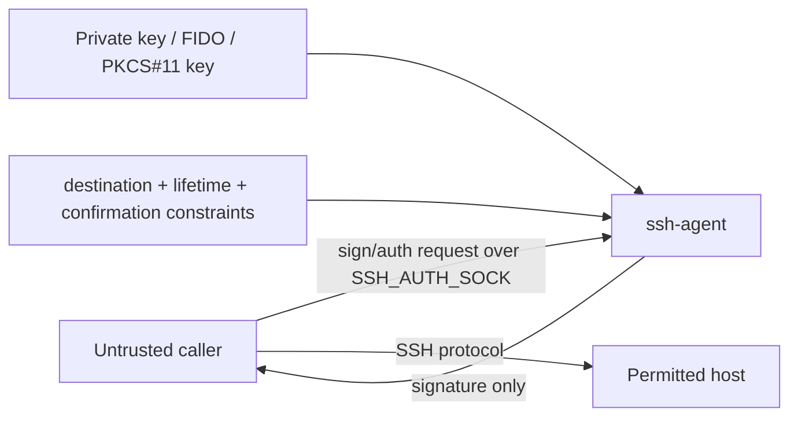
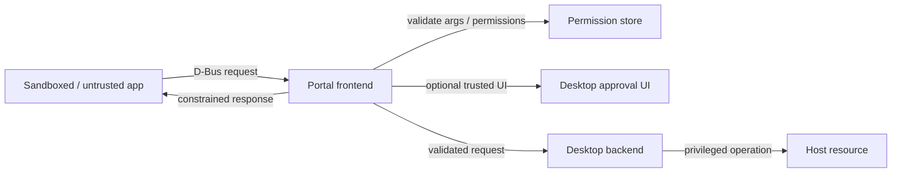
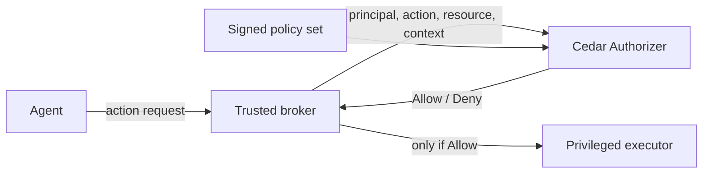
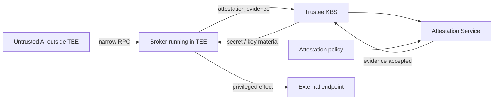
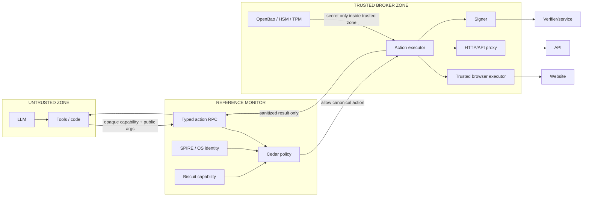
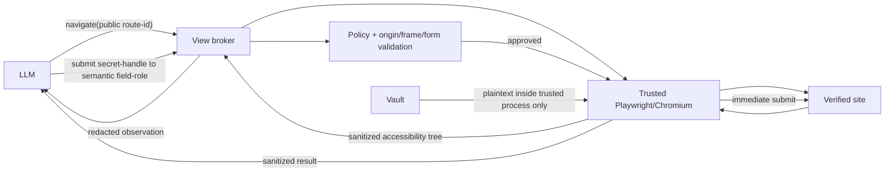

# Trustworthy Secret Brokers for Untrusted AI Agents

## Executive summary

The core problem is older than LLMs. It is the problem of letting an untrusted principal **exercise narrowly bounded authority without learning the authority-bearing secret**. The relevant prior art is scattered across privilege separation, capability systems, authentication agents, credential-injection proxies, hardware wallets, workload identity, trusted execution, browser sandboxes, information-flow control, desktop portals, payment tokenization, and confidential-computing systems. Saltzer and Schroeder's 1975 terminology is already strikingly close: a *capability* is an unforgeable ticket authorizing access, a *protected subsystem* exposes designated entry points while hiding its internal objects, and *confinement* means giving a program access to data while preventing it from releasing that data. citeturn35view0

The strongest conclusion from this research is:

> **Do not build an AI password manager. Build a privileged action portal.**

The LLM should never call `get_secret("chase_password")`. Ideally, nothing in the agent-accessible RPC schema should even have a type capable of representing plaintext secret material. It should instead invoke operations such as `authenticate(account, destination)`, `sign(key, structured_transaction)`, `submit_private_field(form, field, secret_handle)`, or `request(route, credential_capability)`. The trusted component then performs the action and returns a deliberately constrained result.

There is already a remarkably close OSS implementation of the connection-oriented part of this idea: **CyberArk Secretless Broker**. Its explicit design goal is that the client application no longer has direct access to the password. It retrieves credentials through a credential provider, performs the authentication handshake itself, then proxies the resulting connection. The current project still had releases in February 2026, including v1.7.32 at commit `37fecd6`. citeturn29view0turn30view3

Secretless Broker is not, however, sufficient for an adversarial LLM. Its README explicitly says that after establishing the backend connection it shuttles traffic between client and server. That means it removes the password from the client's memory but does **not** necessarily reduce the client's authenticated authority. A malicious agent could potentially perform anything that the resulting database, HTTP, or SSH session permits. citeturn29view0

A second almost-perfect precedent is **OpenSSH `ssh-agent`**. The private key stays in the agent while callers request authentication operations. OpenSSH can constrain keys to destinations and connection paths, require confirmation before use, impose lifetimes, and distinguish forwarded-agent contexts. Its documentation explicitly says private keys and passphrases do not traverse the forwarded connection. This is nearly the API philosophy an AI secret broker should generalize. citeturn26view0turn26view1turn27view0

A third is **XDG Desktop Portal**. It was designed so sandboxed applications can ask a trusted desktop-side component for narrowly defined operations over D-Bus. Its front end performs argument validation, permission management, user interaction, and mediation before invoking a backend. That is almost exactly the correct control plane for an untrusted AI agent. Importantly, XDG's existing `Secret` portal is *not* suitable because it actually returns a per-application secret. The reusable idea is the portal architecture, not that particular API. citeturn27view1turn28view0turn28view2turn28view3

The best practical architecture I found is therefore a composition rather than a single product:

**Secretless-style credential injection + OpenSSH-style non-exportable operation APIs + XDG-portal-style mediation + Cedar/Biscuit authorization + SPIRE workload identity + OpenBao custody/dynamic credentials + a separate trusted browser executor + Envoy/mitmproxy-style network mediation + optional Trustee/TEE attestation + TPM/FIDO/HSM-backed non-exportable keys.**

Those pieces already implement most of the hard primitives independently. OpenBao provides encrypted storage, dynamic leased secrets and revocation. SPIRE attests workloads and issues identities. Cedar gives an independently analyzable authorization engine. Biscuit provides cryptographically attenuable tokens. Trustee gates secret delivery on attestation. Wasmtime/cap-std, Capsicum, Firecracker and related systems can remove ambient host authority. citeturn32view0turn31view0turn33view0turn33view1turn33view4turn33view2turn35view1

The largest missing OSS component is the **browser/form portal**. Existing browser-automation frameworks are intentionally powerful. Playwright even exposes raw Chrome DevTools Protocol sessions; Chromium's own sandbox architecture exists precisely because web renderers are untrusted. Giving the same malicious agent unrestricted browser control and then autofilling an SSN or password into that browser destroys the desired information-flow boundary. citeturn35view3turn35view4

For browser operations, the LLM therefore must **not own CDP, Playwright, the browser profile, cookies, local storage, authentication headers, password fields, or screenshots before redaction**. A separate trusted browser process should own those things and expose a portal API based on semantic actions.

The information-theoretic target should actually be stated conditionally:

\[
I(S;V_A\mid O,P)=0
\]

where \(S\) is the protected secret, \(V_A\) is everything observable by the malicious agent, \(O\) is the explicitly authorized output, and \(P\) is public/contextual state. In ordinary software using standard encryption this is normally a **computational** rather than literal information-theoretic guarantee. Perfect threshold secret sharing can provide information-theoretic secrecy for fewer than the reconstruction threshold of shares, but that does not solve runtime leakage after reconstruction.

This distinction matters. **Sharding is primarily a custody primitive. Capability mediation is the execution primitive. Information-flow control is the leakage primitive.** Using only the first leaves the hard problem unsolved.

There is also a fundamental impossibility boundary. For an old-fashioned password login, the authorized website ultimately has to learn or verify information derived from the password. If that destination is itself malicious or colludes with the AI, no intermediary can guarantee secrecy from it. By contrast, WebAuthn/FIDO, HSM signing and similar challenge-response mechanisms allow a private key to remain genuinely non-exportable while still authenticating to the target. `libfido2`, TPM tooling, PKCS#11 ecosystems and OpenSSH's treatment of authenticator-hosted keys provide reusable foundations for this stronger model. citeturn35view8turn35view7turn35view6turn26view0

Finally, the phrase **"100% confident" needs qualification**. You can get very strong guarantees of the form "no agent-accessible interface contains an operation that returns S, and the agent cannot read the trusted process memory under the stated isolation model." You can potentially formally verify parts of that boundary. You cannot honestly prove unconditional zero leakage for a real browser, network, operating system, CPU and remote website without very restrictive assumptions. LIO and related IFC systems demonstrate why: information can propagate through effects, not only through explicit return values. citeturn34academia0turn34academia5

One audit note is also important. I did **not** rely on several AI-native project names that appeared in the earlier quick investigation because I could not substantiate them through primary-source retrieval during this deeper pass. The strongest findings instead came from the older adjacent fields the follow-up question correctly suggested searching.

## Problem, threat model, and taxonomy

The most useful abstraction is not "LLM credential management." It is:

\[
\boxed{\text{Untrusted principal} + \text{opaque authority} \rightarrow
\text{authorized effect without secret disclosure}}
\]

Saltzer and Schroeder's protected-subsystem model is almost exactly this: internal representation is unavailable except through designated entry points. Their confinement definition is even closer to the LLM problem because it explicitly asks whether a program can operate on data without releasing it. citeturn35view0

**Security objectives.** Let \(A\) be the adversarial agent, \(B\) the broker, \(S\) a secret, \(E\) the external endpoint, \(C\) a capability and \(O\) the permitted result. A serious design needs more than secret confidentiality:

| Property | Desired condition | Why it matters |
|---|---|---|
| Secret non-disclosure | \(S\notin V_A\) and ideally \(I(S;V_A\mid O,P)\approx0\) | The model cannot print, log or transmit the credential. |
| Non-exportability | No exposed broker operation is equivalent to `read(S)` | Prevents trivial API misuse. |
| Complete mediation | Every secret-dependent action crosses the broker | Otherwise a bypass invalidates the model. Saltzer and Schroeder identified complete mediation as a foundational protection problem. citeturn35view0 |
| Destination binding | Secret-dependent actions are cryptographically/policy-bound to an intended endpoint | Prevents `fill(password, attacker.com)`. |
| Action confinement | The capability authorizes a narrow effect, not an unrestricted authenticated session | Prevents "password hidden, account fully compromised." |
| Principal binding | Capabilities are usable only by the intended workload/session | Reduces capability forwarding and theft. |
| Freshness | Nonce, expiration, use count and replay state are enforced | Makes copied capabilities less useful. |
| Controlled declassification | Only explicitly approved information may flow back | Converts vague "redaction" into an enforceable policy concept. |
| Auditable authority | Broker records canonical authorized actions without logging secrets | Lets users detect misuse without creating a second secret store. |
| Revocability | Credentials/capabilities can be invalidated independently | Limits blast radius. OpenBao's lease/revocation model is directly relevant. citeturn32view0 |

The assumed attacker should be harsh. The LLM may be deliberately malicious, fully prompt-injected, able to construct arbitrary RPC arguments, control ordinary untrusted code, inspect its own environment and files, replay previous requests, collaborate with a malicious page, attempt SSRF, manipulate redirects or selectors, infer information from errors and timing, and use every bit returned by every tool as an exfiltration channel. This is stronger than merely assuming accidental prompt injection.

The agent should therefore be treated much like an untrusted browser renderer. The Capsicum authors described the problem of programs such as browsers receiving ambient user authority despite processing hostile inputs and proposed compartmentalization using unforgeable, attenuated capabilities. Their implementation denies global namespaces after `cap_enter` and delegates specific file-descriptor authority over IPC. citeturn35view1

The browser deserves an additional threat boundary. If the agent owns raw CDP, a browser profile, unrestricted JavaScript evaluation or authenticated network traffic, then keeping the password itself hidden is largely cosmetic. Playwright's `CDPSession` is explicitly a direct means of communicating with Chromium through Chrome DevTools Protocol. Chromium itself uses a process sandbox so compromised renderers cannot exercise the browser process's full host authority. citeturn35view3turn35view4

The A-Z families from the research brief collapse into the following underlying primitives:

| Families from the brief | Generalized family | Reusable abstraction |
|---|---|---|
| A, P, R, S, W | Secretless brokers, workload identity, API/database proxies, CI credentials | Exchange or inject authority at a trusted intermediary rather than expose long-lived credentials. |
| B, H, O | SSH agents, HSMs, hardware wallets, remote signing | Expose `operate_with_key()` rather than `export_key()`. OpenSSH is the canonical software example. citeturn26view0turn27view0 |
| C, M | Object capabilities, Macaroons/Biscuit, policy engines | Give the caller an attenuated authority handle scoped to object, action and context. Macaroons were explicitly designed for decentralized authorization with contextual caveats. citeturn35view2 |
| D, Z | Information-flow control, noninterference, reference monitors | Track what secret data influences and restrict effects accordingly. LIO dynamically raises labels as sensitive information is observed. citeturn34academia0 |
| E, L, N | Privilege separation, sandboxes, desktop portals | Put risky code in a low-authority process and mediate privileged requests through a narrow IPC interface. XDG Portal and Capsicum are unusually close. citeturn28view3turn35view1 |
| F | Browser mediation | Keep secret-bearing DOM/browser state inside a trusted browser executor rather than the agent-facing automation process. |
| G, H | Tokenization and transaction authorization | Replace reusable secrets with narrow tokens or explicit transaction intents. |
| I | Confidential computing and remote attestation | Prove which broker code is running before provisioning it with secrets. Trustee combines a Key Broker Service with TEE-evidence verification. citeturn33view4 |
| J, K, Y | Secret sharing, MPC, ZK, FHE | Compute without centralizing some forms of plaintext, useful where trust must be split, but usually excessive for a single trusted broker. |
| Q, W | Signing, attestations, transparency, CI provenance | Produce durable evidence of what privileged software/action was authorized. |
| U, X | Data clean rooms, data diodes | Restrict what a consumer may learn even when computation is permitted. |
| V | DRM architecture | Separate encrypted objects, policy and a restricted decryption module. Useful as cautionary prior art because local clients remain difficult to confine. |

This taxonomy produces an important design decomposition:

\[
\textbf{custody} \neq \textbf{authorization} \neq \textbf{information flow}
\]

OpenBao is primarily excellent at custody and secret lifecycle. Cedar is primarily authorization. Capsicum/Wasmtime/IFC techniques are about confinement and effects. Secretless/OpenSSH are operation mediators. Trustee is about proving the identity/state of the trusted executor. No single one answers all layers. citeturn32view0turn33view0turn35view1turn29view0turn33view4

## Open-source landscape

I cataloged **122 OSS projects and research implementations** that contribute at least one potentially reusable primitive. This deliberately includes systems whose original use case is very different from AI. That is the point: architectural fit is more valuable here than surface terminology.

For activity, **V26** means I directly verified a 2026 source/release signal during this research; **M** means an ongoing/maintained project whose precise current release was not individually pinned in this pass; **R** means research, legacy, archived, or mainly useful as prior art. The repository links are the primary metadata source. Licenses marked "mixed" should be checked per component before redistribution.

**Credential custody, workload identity and authorization**

| Project / repo | License | Lang. | Activity | Primitive | Reuse | Integration | Primary caveat |
|---|---|---:|:---:|---|:---:|:---:|---|
| [CyberArk Secretless Broker](https://github.com/cyberark/secretless-broker) | Apache-2.0 | Go | **V26** | Credential-injection connection broker | VH | M | Hides password, but passes arbitrary post-auth traffic. citeturn29view0turn30view3 |
| [OpenBao](https://github.com/openbao/openbao) | MPL-2.0 | Go | **V26** | Vault, dynamic secrets, leases, transit crypto | VH | M | Standard secret APIs can return plaintext. citeturn32view0turn32view1 |
| [Infisical](https://github.com/Infisical/infisical) | MIT core; separate enterprise code | TS/Go | **V26** | Secret/PAM platform, identities, dynamic credentials | H | M | General-purpose clients can retrieve plaintext. citeturn35view5 |
| [Conjur OSS](https://github.com/cyberark/conjur) | LGPL-3.0 | Ruby | M | Policy-controlled secret storage | H | M | Secret retrieval is still an exposed primitive. |
| [External Secrets Operator](https://github.com/external-secrets/external-secrets) | Apache-2.0 | Go | M | Secret-store integration | M | L | Usually materializes plaintext into workload-visible secrets. |
| [Secrets Store CSI Driver](https://github.com/kubernetes-sigs/secrets-store-csi-driver) | Apache-2.0 | Go | M | Mount external secrets into pods | M | L | Workload can read mounted plaintext. |
| [Bank-Vaults](https://github.com/bank-vaults/bank-vaults) | Apache-2.0 | Go | M | Vault/Kubernetes secret tooling | M | M | Injection rather than strict non-disclosure. |
| [SOPS](https://github.com/getsops/sops) | MPL-2.0 | Go | M | Envelope-encrypted configuration | M | L | Decryption recipient still obtains plaintext. |
| [age](https://github.com/FiloSottile/age) | BSD-3-Clause | Go | M | Small encrypted-blob transport | M | L | Custody/transport only. |
| [cert-manager](https://github.com/cert-manager/cert-manager) | Apache-2.0 | Go | M | Short-lived certificate lifecycle | H | M | Identity primitive, not action policy. |
| [step-ca](https://github.com/smallstep/certificates) | Apache-2.0 | Go | M | Online CA, SSH/X.509 credential issuance | H | M | Issued credential may still be overbroad. |
| [SPIRE](https://github.com/spiffe/spire) | Apache-2.0 | Go | **V26** | Attested workload identity/SVIDs | VH | M | Establishes identity, not action-level authorization. citeturn31view0turn31view1 |
| [go-spiffe](https://github.com/spiffe/go-spiffe) | Apache-2.0 | Go | M | SPIFFE Workload API SDK | H | L | SDK only. |
| [Teleport](https://github.com/gravitational/teleport) | AGPL-3.0 | Go | M | Identity-aware access proxy, short-lived credentials | H | H | Sessions can still give broad endpoint authority. |
| [oauth2-proxy](https://github.com/oauth2-proxy/oauth2-proxy) | MIT | Go | M | OAuth authentication reverse proxy | M | L | Session/cookie becomes bearer authority. |
| [Pomerium](https://github.com/pomerium/pomerium) | Apache-2.0 | Go | M | Identity-aware proxy | H | M | Access is resource-oriented, not secret-operation-oriented. |
| [Authelia](https://github.com/authelia/authelia) | Apache-2.0 | Go | M | Authentication/authorization gateway | M | M | Same authenticated-session issue. |
| [Keycloak](https://github.com/keycloak/keycloak) | Apache-2.0 | Java | M | OAuth/OIDC identity | M | M | Tokens remain transferable authority unless sender-constrained. |
| [Dex](https://github.com/dexidp/dex) | Apache-2.0 | Go | M | Federated OIDC | M | M | Identity plumbing, not action mediation. |
| [Ory Hydra](https://github.com/ory/hydra) | Apache-2.0 | Go | M | OAuth2/OIDC server | M | M | Requires separate policy/PEP. |
| [ZITADEL](https://github.com/zitadel/zitadel) | AGPL-3.0 | Go | M | Identity/OIDC | M | M | Same token-authority caveat. |
| [Kanidm](https://github.com/kanidm/kanidm) | MPL-2.0 | Rust | M | Identity/access management | M | M | Not an action broker. |
| [OPA](https://github.com/open-policy-agent/opa) | Apache-2.0 | Go | M | General policy decision engine | VH | L | Does not enforce anything unless every path reaches its PEP. citeturn32view3 |
| [Cedar](https://github.com/cedar-policy/cedar) | Apache-2.0 | Rust | **V26** | Fine-grained analyzable authorization | VH | L | Trusts supplied principal/action/resource/context attributes. citeturn33view0 |
| [Casbin](https://github.com/casbin/casbin) | Apache-2.0 | Go | M | Authorization library | H | L | Less naturally suited to cryptographic capability attenuation. |
| [OpenFGA](https://github.com/openfga/openfga) | Apache-2.0 | Go | M | Relationship authorization | M | M | Good resource graph, weaker fit for transaction semantics. |
| [SpiceDB](https://github.com/authzed/spicedb) | Apache-2.0 | Go | M | Zanzibar-style permissions | M | M | Same action-parameter limitation. |
| [Biscuit](https://github.com/eclipse-biscuit/biscuit-rust) | Apache-2.0 | Rust | **V26** | Cryptographically attenuable authorization token | VH | L | Bearer theft/replay unless channel/principal bound. citeturn33view1 |
| [go-macaroon](https://github.com/go-macaroon/macaroon) | BSD-style | Go | M | Caveated bearer capability | VH | L | Third-party caveats are powerful but verification errors are dangerous. |
| [Agoric Endo / SES](https://github.com/endojs/endo) | Apache-2.0 | JS | M | Object-capability confinement | H | H | JS confinement boundary needs careful dependency discipline. |
| [Cap'n Proto](https://github.com/capnproto/capnproto) | MIT | C++ | M | Capability-oriented RPC | H | M | RPC references still need action policy. |
| [Tahoe-LAFS](https://github.com/tahoe-lafs/tahoe-lafs) | GPL family | Python | M | Capability URLs for encrypted storage | M | M | Capability possession can itself grant broad read/write authority. |
| [LND](https://github.com/lightningnetwork/lnd) | MIT | Go | M | Macaroon-secured RPC | H | M | Application-specific, but excellent caveat precedent. |

Secretless is unusually important because its documented architecture already separates the untrusted client from credential storage and authentication. SPIRE's documentation similarly makes workload attestation and local Workload API delivery explicit, while Cedar separates policy from application code so policies can be independently analyzed and audited. citeturn29view0turn31view1turn33view0

**Privilege separation, non-exportable operations and sandboxing**

| Project / repo | License | Lang. | Activity | Primitive | Reuse | Integration | Primary caveat |
|---|---|---:|:---:|---|:---:|:---:|---|
| [OpenSSH](https://github.com/openssh/openssh-portable) | BSD-style | C | **V26** | `ssh-agent`, constrained remote signing/authentication | **VH** | M | Socket access grants use authority; same-user/root can abuse it. citeturn26view0turn26view1 |
| [GnuPG](https://github.com/gpg/gnupg) | GPL-3.0+ | C | M | `gpg-agent`, pinentry, key operations | H | M | Generic signing can become an oracle/authority escalation. |
| [p11-kit](https://github.com/p11-glue/p11-kit) | BSD-style | C | **V26** | PKCS#11 module loading/proxying | H | M | PKCS#11 is much broader than an AI-safe operation API. citeturn35view6 |
| [SoftHSMv2](https://github.com/softhsm/SoftHSMv2) | BSD-2-Clause | C++ | M | Software PKCS#11 HSM | H | M | Same-host software memory is not a hardware boundary. |
| [OpenSC](https://github.com/OpenSC/OpenSC) | LGPL-2.1+ | C | M | Smart-card/PKCS#11 middleware | H | M | Middleware, not high-level transaction policy. |
| [tpm2-tools](https://github.com/tpm2-software/tpm2-tools) | BSD-3-Clause | C | **V26** | TPM sealing/signing | H | M | Raw TPM primitives are easy to compose incorrectly. citeturn35view7 |
| [tpm2-tss](https://github.com/tpm2-software/tpm2-tss) | BSD-2-Clause | C | M | TPM software stack | H | H | Low-level API. |
| [tpm2-pkcs11](https://github.com/tpm2-software/tpm2-pkcs11) | BSD-style | C | M | TPM-backed PKCS#11 keys | H | M | Signing policy still external. |
| [libfido2](https://github.com/Yubico/libfido2) | BSD-2-Clause | C | **V26** | FIDO2/WebAuthn device operations | VH | M | Specialized to WebAuthn/FIDO semantics. citeturn35view8 |
| [xdg-desktop-portal](https://github.com/flatpak/xdg-desktop-portal) | LGPL-2.1+ | C | **V26** | Privileged-action mediation over D-Bus | **VH** | M | Existing Secret portal exports a secret; new action APIs are needed. citeturn27view1turn28view0 |
| [Flatpak](https://github.com/flatpak/flatpak) | LGPL-2.1+ | C | M | Sandboxed app + portal model | H | M | Linux desktop specific. |
| [polkit](https://github.com/polkit-org/polkit) | LGPL family | C | M | Privileged action authorization | H | M | Coarse action authorization without data-flow semantics. |
| [bubblewrap](https://github.com/containers/bubblewrap) | LGPL-2.0+ | C | M | Namespace sandbox | H | L | Kernel remains in TCB. |
| [minijail](https://android.googlesource.com/platform/external/minijail/) | BSD-style | C | M | Namespace/seccomp jail | H | M | Linux-specific low-level confinement. |
| [Capsicum](https://github.com/freebsd/freebsd-src) | BSD | C | M | Capability mode and descriptor rights | **VH** | H | Best on FreeBSD; porting architecture is easier than porting kernel primitive. |
| [seL4](https://github.com/seL4/seL4) | Mixed; GPL kernel/permissive ecosystem | C/Isabelle | **V26** | Formally verified capability microkernel | VH assurance | VH | Platform integration cost is extreme. Current project had 2026 proof updates. citeturn33view10 |
| [CHERI / CheriBSD](https://github.com/CTSRD-CHERI/cheribsd) | Mixed BSD/LLVM | C/C++ | M | Hardware-enforced capabilities | VH concept | VH | Specialized hardware/toolchain. |
| [Wasmtime](https://github.com/bytecodealliance/wasmtime) | Apache-2.0 + LLVM exception | Rust | **V26** | WebAssembly sandbox/runtime | VH | M | Host functions define the real authority boundary. citeturn33view2 |
| [Wasmer](https://github.com/wasmerio/wasmer) | MIT | Rust | M | WebAssembly sandbox | H | M | Same host-call caveat. |
| [cap-std](https://github.com/bytecodealliance/cap-std) | Apache-2.0 + LLVM exception | Rust | **V26** | Capability-oriented Rust standard-library alternative | VH | L | Ambient capabilities can reappear through other dependencies. citeturn35view10 |
| [gVisor](https://github.com/google/gvisor) | Apache-2.0 | Go | M | User-space syscall/kernel sandbox | H | M | Larger TCB than a narrow broker. |
| [Firecracker](https://github.com/firecracker-microvm/firecracker) | Apache-2.0 | Rust | **V26** | MicroVM isolation | H | M | Host broker and VMM remain trusted. citeturn35view12 |
| [Kata Containers](https://github.com/kata-containers/kata-containers) | Apache-2.0 | Go/Rust | M | VM-backed containers | H | H | Operationally heavy for local desktop use. |
| [nsjail](https://github.com/google/nsjail) | Apache-2.0 | C++ | M | Namespaces/seccomp/cgroups | H | L | Kernel sandbox, not semantic authorization. |
| [libseccomp](https://github.com/seccomp/libseccomp) | LGPL-2.1 | C | M | Syscall filtering | M | L | Syscall allowlisting does not understand secret flows. |
| [Landlock](https://github.com/landlock-lsm/linux-doc) | GPL kernel | C | M | Unprivileged Linux sandboxing | M | L | Primarily OS-resource confinement. |
| [OpenBSD pledge/unveil](https://github.com/openbsd/src) | BSD/ISC | C | M | Process capability reduction | H | M | OS-specific. |
| [LIO](https://github.com/scslab/lio) | BSD-style | Haskell | R | Dynamic information-flow control | VH concept | H | Language/runtime-specific. citeturn34academia0 |
| [LIO*](https://github.com/secure-foundations/lio-star) | Research | F*/C | R | Verified IFC | VH assurance | VH | Research maturity/toolchain. citeturn34academia5 |
| [LWeb](https://github.com/scslab/lweb) | Research | Haskell | R | Web/database IFC | H | VH | Not a generic broker. citeturn34academia2 |
| [CamFlow](https://github.com/CamFlow/camflow) | Mixed | C | R/M | OS provenance/IFC | H concept | VH | Kernel/infrastructure invasive. |
| [FlowDroid](https://github.com/secure-software-engineering/FlowDroid) | LGPL family | Java | M | Static information-flow analysis | M | H | Analyzer, not runtime enforcement. |
| [TaintDroid](https://github.com/TaintDroid) | Mixed AOSP/GPL | Java/C++ | R | Dynamic taint propagation | H concept | VH | Old Android-specific implementation. |

Capsicum is particularly instructive. Its capabilities are intentionally delegable, unforgeable tokens of authority, rights can only be reduced, and capability mode cuts processes off from global namespaces. The authors also emphasize that accidental ambient authority in complex applications is the core problem. That framing maps exceptionally well to LLM tools. citeturn35view1

**Browser mediation, trusted execution and privacy-preserving computation**

| Project / repo | License | Lang. | Activity | Primitive | Reuse | Integration | Primary caveat |
|---|---|---:|:---:|---|:---:|:---:|---|
| [Chromium](https://chromium.googlesource.com/chromium/src/) | BSD-style | C++ | **V26** | Multiprocess browser sandbox | VH | VH | Huge TCB; normal automation APIs remain extremely powerful. citeturn35view3 |
| [Firefox](https://github.com/mozilla-firefox/firefox) | MPL-2.0 | C++/Rust | M | Multiprocess browser, credential/WebAuthn stack | H | VH | Huge codebase. |
| [Playwright](https://github.com/microsoft/playwright) | Apache-2.0 | TS | **V26** | Browser automation and CDP | H implementation | M | **Do not expose directly to adversarial agent.** citeturn35view4 |
| [Puppeteer](https://github.com/puppeteer/puppeteer) | Apache-2.0 | TS | M | CDP browser control | H implementation | M | Same over-authority problem. |
| [Selenium](https://github.com/SeleniumHQ/selenium) | Apache-2.0 | Multi | M | WebDriver automation | M | L | Broad DOM/browser authority. |
| [mitmproxy](https://github.com/mitmproxy/mitmproxy) | MIT | Python | **V26** | Programmable HTTP/TLS interception | VH | M | TLS termination enlarges broker TCB. citeturn33view7 |
| [Envoy](https://github.com/envoyproxy/envoy) | Apache-2.0 | C++ | **V26** | Programmable service proxy/ext-auth | VH | M | Network policy alone cannot secure DOM/browser state. citeturn32view6 |
| [HAProxy](https://github.com/haproxy/haproxy) | GPL/LGPL | C | M | TCP/HTTP proxy | H | M | Less convenient semantic programmability. |
| [Caddy](https://github.com/caddyserver/caddy) | Apache-2.0 | Go | M | Extensible HTTP proxy | H | L | Plugin itself becomes trusted. |
| [Traefik](https://github.com/traefik/traefik) | MIT | Go | M | Dynamic reverse proxy | M | L | Not intrinsically secret-aware. |
| [Apache Guacamole](https://github.com/apache/guacamole-client) | Apache-2.0 | Java/C | M | Remote-browser/desktop gateway pattern | H concept | H | Pixels/keystrokes are uncontrolled output channels. |
| [noVNC](https://github.com/novnc/noVNC) | MPL-2.0 | JS | M | Remote framebuffer mediation | M concept | M | Client receives rendered secrets unless redacted. |
| [KeePassXC](https://github.com/keepassxreboot/keepassxc) | GPL-3.0 | C++ | M | Password vault/browser integration | H adapter ideas | M | Normal user/browser interfaces ultimately reveal/autofill secrets. |
| [Vaultwarden](https://github.com/dani-garcia/vaultwarden) | AGPL-3.0 | Rust | M | Password-vault server | H custody | M | Designed to serve credential values to trusted clients. |
| [Passbolt](https://github.com/passbolt/passbolt_api) | AGPL-3.0 | PHP/JS | M | Collaborative credential vault | M | M | Same plaintext-client expectation. |
| [Gramine](https://github.com/gramineproject/gramine) | LGPL-3.0 | C | **V26** | Run Linux apps inside SGX | H | H | TEE side channels and broker bugs remain. citeturn33view5 |
| [Open Enclave SDK](https://github.com/openenclave/openenclave) | MIT | C/C++ | M | Enclave abstraction | H | H | Lower-level than Gramine. |
| [Confidential Containers](https://github.com/confidential-containers) | Apache-2.0 | Go/Rust | M | TEE-backed container workload | H | H | Infrastructure complexity. |
| [Trustee](https://github.com/confidential-containers/trustee) | Apache-2.0 | Rust | **V26** | Attestation + secret-delivery KBS | **VH** | H | Must attest the *broker*, not the malicious agent. citeturn33view4 |
| [Keylime](https://github.com/keylime/keylime) | Apache-2.0 | Python/Rust | **V26** | TPM-based remote trust/attestation | H | H | Proves state, not semantic correctness of broker API. citeturn33view6 |
| [Enarx](https://github.com/enarx/enarx) | Apache-2.0 | Rust | R | Cross-TEE application runtime | M | H | Project maturity/status makes it less attractive than Gramine/CoCo. |
| [Occlum](https://github.com/occlum/occlum) | BSD-style | Rust/C | M | SGX LibOS | M | H | SGX-specific complexity. |
| [Keystone](https://github.com/keystone-enclave/keystone) | BSD-style | C | R/M | Open RISC-V TEE | M concept | VH | Hardware niche. |
| [Asylo](https://github.com/google/asylo) | Apache-2.0 | C++ | R | Enclave abstraction | M concept | H | Primarily historical prior art. |
| [MP-SPDZ](https://github.com/data61/MP-SPDZ) | BSD-style | C++/Python | M | General MPC | M | VH | Usually unnecessary for one trusted broker. |
| [EMP-toolkit](https://github.com/emp-toolkit) | MIT | C++ | M | Secure two-party computation | M | H | Building-block complexity. |
| [libOTe](https://github.com/osu-crypto/libOTe) | MIT | C++ | M | Oblivious transfer | L/M | H | Primitive, not complete architecture. |
| [OpenFHE](https://github.com/openfheorg/openfhe-development) | BSD-2-Clause | C++ | **V26** | FHE | M special cases | VH | Poor fit for arbitrary browser/network effects; v1.5.1 released in 2026. citeturn35view14 |
| [Microsoft SEAL](https://github.com/microsoft/SEAL) | MIT | C++ | M | Homomorphic encryption | L | H | Arithmetic workloads, not arbitrary endpoint interaction. |
| [TFHE-rs](https://github.com/zama-ai/tfhe-rs) | BSD-3-Clause | Rust | M | FHE | M special cases | VH | Same fit problem. |
| [PySyft](https://github.com/OpenMined/PySyft) | Apache-2.0 | Python | M | Remote privacy-preserving computation | M concept | H | Much broader data-governance stack. |
| [OpenDP](https://github.com/opendp/opendp) | BSD-3-Clause | Rust/Python | M | Differential privacy | M concept | M | Protects statistical data, not transactional secrets. |
| [Google differential-privacy](https://github.com/google/differential-privacy) | Apache-2.0 | C++/Go | M | DP primitives | L direct | M | Aggregate privacy model differs from secret operations. |
| [Zcash FROST](https://github.com/ZcashFoundation/frost) | Apache/MIT family | Rust | M | Threshold Schnorr signatures | H specialized | H | Only signing, but excellent split-trust primitive. |
| [multi-party-ecdsa](https://github.com/ZenGo-X/multi-party-ecdsa) | GPL family | Rust | R | Threshold ECDSA/MPC | H specialized | H | Older implementation and larger crypto TCB. |

TEE systems deserve a narrow role. Trustee's architecture explicitly consists of a Key Broker Service that facilitates remote attestation and secret delivery plus an Attestation Service that verifies TEE evidence. That is useful for ensuring secrets are released only to an approved broker binary. It does **not** make a dangerous broker RPC safe. A perfectly attested binary exposing `get_secret()` is still a perfectly attested secret-exfiltration service. citeturn33view4

**Signing, provenance, CI, hardware wallets and adjacent systems**

| Project / repo | License | Lang. | Activity | Primitive | Reuse | Integration | Primary caveat |
|---|---|---:|:---:|---|:---:|:---:|---|
| [cosign](https://github.com/sigstore/cosign) | Apache-2.0 | Go | **V26** | Signing/keyless signing client | H | M | Generic signing authority still needs intent policy. citeturn33view9 |
| [Fulcio](https://github.com/sigstore/fulcio) | Apache-2.0 | Go | M | Short-lived signing certificates | H | M | Relies on external identity. |
| [Rekor](https://github.com/sigstore/rekor) | Apache-2.0 | Go | M | Transparency log | H audit | M | Public logging can itself leak metadata. |
| [in-toto](https://github.com/in-toto/in-toto) | Apache-2.0 | Python | M | Signed supply-chain attestations | H audit | M | Evidence, not runtime enforcement. |
| [python-tuf](https://github.com/theupdateframework/python-tuf) | MIT | Python | M | Delegated metadata/trust | M | M | Different threat surface. |
| [Notation](https://github.com/notaryproject/notation) | Apache-2.0 | Go | M | Artifact signing/trust policy | M/H | M | Artifact-specific. |
| [Tekton Chains](https://github.com/tektoncd/chains) | Apache-2.0 | Go | M | Pipeline signing/provenance | M | M | CI-specific. |
| [gitsign](https://github.com/sigstore/gitsign) | Apache-2.0 | Go | M | Keyless Git signing | M | L | Narrow operation. |
| [GitHub Actions Runner](https://github.com/actions/runner) | MIT | C# | M | Ephemeral CI execution/OIDC patterns | H concept | M | Jobs can read any directly injected secret. |
| [GitLab Runner](https://gitlab.com/gitlab-org/gitlab-runner) | MIT | Go | M | Isolated CI jobs, federated identity | H concept | M | Same injected-secret problem. |
| [Tekton Pipelines](https://github.com/tektoncd/pipeline) | Apache-2.0 | Go | M | Pipeline workload isolation | M | M | Orchestration rather than broker. |
| [Argo Workflows](https://github.com/argoproj/argo-workflows) | Apache-2.0 | Go | M | Workflow isolation | M | M | Secret volumes/vars remain visible to jobs. |
| [Trezor Firmware](https://github.com/trezor/trezor-firmware) | GPL-3.0 | C/Python | **V26** | Trusted transaction display + isolated signing | **VH concept** | H | Cryptocurrency-specific parser/UI. citeturn33view8 |
| [SeedSigner](https://github.com/SeedSigner/seedsigner) | MIT | Python | M | Air-gapped transaction signing | H concept | M/H | Cryptocurrency specific. |
| [Specter-DIY](https://github.com/cryptoadvance/specter-diy) | MIT | Python/embedded | M | Air-gapped signing | H concept | H | Specialized UX/protocol. |
| [Bitcoin Core HWI](https://github.com/bitcoin-core/HWI) | MIT | Python | M | Uniform hardware-wallet operation API | VH adapter concept | M | Crypto transaction domain only. |
| [Safe smart contracts](https://github.com/safe-global/safe-smart-account) | LGPL-3.0 | Solidity | M | Policy/multisig transaction authorization | H concept | H | Blockchain-specific trust/transaction model. |
| [Hyperswitch](https://github.com/juspay/hyperswitch) | Apache-2.0 | Rust | M | Payment orchestration/token handling | H concept | H | Payment-domain assumptions. |
| [Cloud SQL Auth Proxy](https://github.com/GoogleCloudPlatform/cloud-sql-proxy) | Apache-2.0 | Go | M | Identity-aware DB connection proxy | H | L/M | Database-specific; application auth semantics remain. |
| [Headscale](https://github.com/juanfont/headscale) | BSD-3-Clause | Go | M | Identity/control plane for overlay network | M | M | Network identity, not action authority. |
| [Shaka Packager](https://github.com/shaka-project/shaka-packager) | BSD-3-Clause | C++ | M | Encryption/license-oriented media packaging | L direct | H | Useful mainly as DRM architectural prior art. |

The hardware-wallet family deserves more attention than its domain suggests. Trezor's repository separates common protocol definitions, firmware, cryptography, host Python clients and persistent storage. The crucial reusable pattern is not cryptocurrency. It is **"untrusted host proposes structured intent; trusted device parses and independently presents the consequential details; private authority never leaves the trusted component."** citeturn33view8

That translates naturally to:

```text
Untrusted LLM proposes:
    Transfer $172.50
    from checking account A
    to saved payee B

Trusted broker independently resolves:
    exact bank origin
    authenticated account
    destination account fingerprint
    amount
    side effects
    approval policy

Trusted display/user approval:
    "Send $172.50 to B?"

Broker executes.
LLM receives:
    transaction_id + status
```

That is much stronger than letting the LLM construct an arbitrary authenticated HTTP request and merely hiding the password.

## Ranked foundations and deep dives

I scored the most promising foundations using architectural fit as the largest factor, followed by security/assurance, adaptation effort in reverse, and extensibility. This is deliberately **not** a popularity ranking.

| Rank | Foundation | Score / 100 | Why it ranks here | Main missing piece |
|---:|---|---:|---|---|
| 1 | **CyberArk Secretless Broker** | 91 | Already implements "client does not possess credential" for real protocols. | Must move from connection authority to action authority. |
| 2 | **OpenSSH `ssh-agent`** | 90 | Mature non-exportable authority RPC plus destination/lifetime/confirmation constraints. | SSH-specific semantics. |
| 3 | **XDG Desktop Portal** | 89 | Best reusable privileged-action mediation architecture. | New secret-dependent action portal needed. |
| 4 | **Cedar** | 86 | Small, expressive, analyzable policy layer; natural principal/action/resource/context model. | Enforcement and authentic context must live elsewhere. |
| 5 | **Confidential Containers Trustee** | 84 | Strong attestation-gated provisioning architecture. | Attested broker still requires safe APIs. |
| 6 | OpenBao | 83 | Excellent OSS secret lifecycle, leases, dynamic credentials, transit operations. | Plaintext read APIs must be hidden from agent. |
| 7 | SPIRE | 82 | Strong workload identity and attestation-to-identity pipeline. | Does not describe permitted actions. |
| 8 | Biscuit | 81 | Attenuable capabilities are an excellent agent authorization token. | Bearer/replay semantics need binding/state. |
| 9 | Capsicum | 80 | Strongest conventional OS analogy for removing ambient authority. | Portability. |
| 10 | Wasmtime + cap-std | 79 | Practical capability-oriented sandbox for untrusted tooling. | Host API must be meticulously designed. |
| 11 | Envoy | 78 | Mature programmable request mediation and egress enforcement. | No browser/DOM semantics. |
| 12 | libfido2 | 78 | Strongest web-login direction because credential private key never leaves authenticator. | Only works where target supports WebAuthn/FIDO. |
| 13 | p11-kit / PKCS#11 ecosystem | 76 | Mature non-exportable crypto-operation abstraction. | API is broader than desired agent capability. |
| 14 | Trezor/HWI pattern | 75 | Excellent structured-intent and independent approval architecture. | Requires generalized transaction schema. |
| 15 | OPA | 74 | Mature flexible policy engine. | Easier to create overly dynamic policies than with a narrow schema. |
| 16 | mitmproxy | 72 | Very fast prototype substrate for request injection/redaction. | MITM/TLS termination increases trusted code. |
| 17 | Keylime | 71 | Hardware-backed measured-state verification. | Attestation is not semantic authorization. |
| 18 | Firecracker | 70 | Strong practical isolation for malicious agent runtime. | Still requires action broker outside VM. |
| 19 | Sigstore stack | 68 | Excellent signing/audit/provenance concepts. | Mostly retrospective evidence. |
| 20 | seL4 | 67 | Highest assurance capability foundation in the set. | Massive practical integration cost for an initial product. |

**Deep dive: CyberArk Secretless Broker**



Secretless' README explicitly states that the client application no longer has direct password access. A Service Connector replaces the target protocol's authentication handshake; credentials are obtained from a credential provider; after authentication Secretless proxies traffic. It supports PostgreSQL, MySQL, SSH/SSH-Agent and HTTP variants and exposes a plugin interface for more connectors. citeturn29view0

| Aspect | Assessment |
|---|---|
| Trust boundary | Broker + credential provider are trusted; client is deliberately outside the credential threat surface. |
| Secret lifecycle | Provider retrieves credential → connector consumes it during handshake → connection persists without giving password to client. |
| IPC | Client connects to a local TCP/Unix-style service endpoint; broker talks separately to target/provider. |
| Relevant source | [`internal/plugin/connectors`](https://github.com/cyberark/secretless-broker/tree/main/internal/plugin/connectors), [`internal/providers`](https://github.com/cyberark/secretless-broker/tree/main/internal/providers), [`internal/plugin/connectors/http/aws/aws.go`](https://github.com/cyberark/secretless-broker/blob/main/internal/plugin/connectors/http/aws/aws.go), [`design/`](https://github.com/cyberark/secretless-broker/tree/main/design). The 2026 release notes specifically reference `internal/providers/awssecrets/provider.go` and the HTTP AWS-signing connector. citeturn30view3 |
| Prototype effort | Roughly **8-20 engineering hours** to demonstrate an agent making credential-free static HTTP/DB calls through it; **30-60 hours** to add a first action-scoped wrapper and hostile-agent tests. |
| Critical weakness | Once authenticated, arbitrary traffic may flow between client and backend. The password is protected, but the *authority* often is not narrowed. |

The minimal adaptation is not to rewrite Secretless first. Put a **semantic action broker in front of it**. The LLM submits `github.create_repository(...)`, not arbitrary bytes destined for an authenticated GitHub connection. The semantic broker validates action parameters and then lets a Secretless-style connector perform only the canonical HTTP transaction.

**Deep dive: OpenSSH `ssh-agent`**



`ssh-agent` explicitly exists to hold private keys. Its Unix-domain socket is the operation interface. Forwarding the socket lets a remote process obtain authentication results without transferring the private key itself. Modern OpenSSH can require per-use confirmation, set identity lifetimes, constrain a key to destinations/paths, and bind an agent connection to the cryptographically authenticated SSH session so destination constraints can be checked. citeturn26view0turn26view1turn27view0

OpenSSH is also refreshingly explicit about what this *does not* protect: `SSH_AUTH_SOCK` is accessible to the current user and can be abused by root or another process running as that user. This is exactly why an LLM broker should place the agent in a different OS principal/sandbox rather than merely hide an environment variable. citeturn26view0

| Aspect | Assessment |
|---|---|
| Trust boundary | `ssh-agent` and key provider trusted; socket client untrusted with *use* authority. |
| Secret lifecycle | Private key loaded/generated → retained in agent/token → signature produced → private key never returned. |
| IPC | Unix-domain socket; protocol documented in [`PROTOCOL.agent`](https://github.com/openssh/openssh-portable/blob/master/PROTOCOL.agent). |
| Relevant source | [`ssh-agent.c`](https://github.com/openssh/openssh-portable/blob/master/ssh-agent.c), [`authfd.c`](https://github.com/openssh/openssh-portable/blob/master/authfd.c), [`ssh-add.c`](https://github.com/openssh/openssh-portable/blob/master/ssh-add.c), [`PROTOCOL.agent`](https://github.com/openssh/openssh-portable/blob/master/PROTOCOL.agent). The protocol defines `session-bind@openssh.com` and `restrict-destination-v00@openssh.com`. citeturn27view0turn33view12turn33view13 |
| Prototype effort | **12-30 hours** to reproduce the architectural pattern as a small Rust/Go generic operation daemon. |
| Critical weakness | `sign(arbitrary_bytes)` would be too powerful for many domains. OpenSSH succeeds because the agent understands enough SSH session context to constrain usage. |

That last point is fundamental. **Non-exportable keys do not imply safe authority.** A malicious model with an unrestricted signing oracle may never learn the private key yet still do everything the key was intended to prevent.

The generalized broker should therefore expose:

```text
sign_structured(
    capability,
    action_type = "bank_transfer",
    canonical_action = {...}
)
```

rather than:

```text
sign_bytes(key_handle, attacker_chosen_bytes)
```

**Deep dive: XDG Desktop Portal**



XDG Desktop Portal exists specifically so sandboxed applications can interact with host functionality through defined D-Bus interfaces rather than receiving broad host access. It has APIs for files, URIs, printing, screenshots, remote desktop and other resources. Most operations return request handles because trusted UI interaction may take time. citeturn27view1turn28view1

Its design documentation says the front end can centralize portal infrastructure and be strict about argument validation before requests reach backends. The permission store maps applications to permissions on individual resources. That is almost the control-plane architecture an AI secret broker needs. citeturn28view2turn28view3

The existing `org.freedesktop.portal.Secret` interface should **not** be copied: it gives the sandbox a per-application master secret through a file descriptor. For an LLM the analogous API should deliberately do the opposite. citeturn28view0

| Aspect | Assessment |
|---|---|
| Trust boundary | Portal front end/backend and approval UI trusted; sandboxed caller is not. |
| Secret lifecycle | Existing Secret portal exports a per-app secret, so replace it with operation-only handles. |
| IPC | D-Bus request objects and asynchronous `Response` signals. citeturn28view1 |
| Relevant source | [xdg-desktop-portal repo](https://github.com/flatpak/xdg-desktop-portal), [Requests](https://flatpak.github.io/xdg-desktop-portal/docs/requests.html), [Permission Store](https://flatpak.github.io/xdg-desktop-portal/docs/doc-org.freedesktop.impl.portal.PermissionStore.html), [design considerations](https://flatpak.github.io/xdg-desktop-portal/docs/design-considerations.html). |
| Prototype effort | **16-32 hours** for a local JSON-RPC/Unix-socket analogue with one trusted approval UI; D-Bus integration is optional for a first prototype. |
| Critical weakness | Portal security depends on designing narrow semantic operations. A generic "execute privileged command" portal would recreate ambient authority. |

This suggests a very clean abstraction:

```text
org.agentbroker.Authenticate
org.agentbroker.HttpRequest
org.agentbroker.FormSubmit
org.agentbroker.SignStructured
org.agentbroker.Transfer
org.agentbroker.UploadPrivateDocument
```

Each is its own protected method with its own policy schema. There is intentionally no `ReadSecret`.

**Deep dive: Cedar**



Cedar is intentionally an authorization language rather than an authentication or secret-management system. Applications invoke its authorization engine against a request and a separately maintained policy set. Its validator can check policy consistency against an application schema. That separation is useful because the LLM does not participate in deciding what its own request means. citeturn33view0

| Aspect | Assessment |
|---|---|
| Trust boundary | Broker must derive trustworthy attributes; Cedar evaluates them. |
| Secret lifecycle | None. This is desirable: policy engine never needs `S`. |
| IPC | Best embedded in broker rather than exposed as an agent-facing network service. |
| Relevant source | [`cedar-policy`](https://github.com/cedar-policy/cedar/tree/main/cedar-policy), [`cedar-policy-core`](https://github.com/cedar-policy/cedar/tree/main/cedar-policy-core), [`cedar-policy-cli`](https://github.com/cedar-policy/cedar/tree/main/cedar-policy-cli). Typical Rust integration centers on `Authorizer::is_authorized` over typed requests/policies/entities. The current repository is Apache-2.0. citeturn32view2turn33view0 |
| Prototype effort | **4-10 hours** to define broker schemas and enforce a small policy set. |
| Critical weakness | Never accept security-sensitive context such as `destination="irs.gov"` merely because the LLM says so. The broker must independently resolve and attest that fact. |

A plausible policy object is:

```text
principal = Agent::"hermes-session-781"
action    = Action::"SubmitSSN"
resource  = Website::"irs-tax-form"
context = {
    top_level_origin: verified_origin,
    field_role: verified_field_role,
    use_count: broker_state,
    user_presence: trusted_ui_state
}
```

Notice that `verified_origin` is not copied from the agent request. It is derived by the trusted browser/network executor.

**Deep dive: Trustee**



Trustee consists of components for attesting confidential guests and providing secrets to them. Its Key Broker Service facilitates remote attestation and secret delivery, while its Attestation Service verifies TEE evidence. It was built for Confidential Containers but is explicitly described as usable with other applications/hardware platforms. citeturn33view4

| Aspect | Assessment |
|---|---|
| Trust boundary | TEE, broker code, attestation verifier and KBS policy are trusted; host/LLM may be untrusted. |
| Secret lifecycle | KBS withholds material until evidence satisfies policy → provision into broker TEE → broker performs operation. |
| IPC | Remote attestation/KBS protocol between guest and Trustee; separate agent-to-broker RPC. |
| Relevant source | [`kbs/`](https://github.com/confidential-containers/trustee/tree/main/kbs), [`attestation-service/`](https://github.com/confidential-containers/trustee/tree/main/attestation-service). These are explicit top-level Trustee components. citeturn33view14turn33view15 |
| Prototype effort | **24-60 additional hours** after the non-TEE broker works, assuming supported confidential-computing infrastructure. |
| Critical weakness | TEE protection cannot compensate for a semantically overpowered broker. It protects the trusted computation *from the host*, not the user *from bad trusted computation*. |

This is why I would put TEE support in a later phase. First make the broker API safe. Then attest that exact broker.

## Composable architecture, minimal prototype, and rewrite opportunities

The architecture I would actually build is a **Secret Action Portal**, with all secret-bearing state on the trusted side of one narrow IPC boundary.



**The action RPC is the product.** Everything else can initially be adapted.

A capability should contain authority descriptors, not encrypted secrets. For example:

```json
{
  "capability_id": "c_918...",
  "principal": "spiffe://local/agent/session-781",
  "action": "private_form.submit",
  "resource": "tax-return-2026",
  "secret_handle": "identity.ssn",
  "destination_id": "irs-production",
  "field_role": "taxpayer_identifier",
  "expires_at": "2026-09-10T19:05:00Z",
  "remaining_uses": 1
}
```

The agent should not be allowed to replace `destination_id` with a raw URL and should not be allowed to turn `field_role` into an arbitrary CSS selector. The broker resolves both to trusted configuration/state.

For API credentials, the ideal ordering is:

```text
native workload/OAuth identity
        ↓
short-lived scoped credential
        ↓
Secretless-style injection
        ↓
static long-lived secret only as last resort
```

SPIRE can attest a workload and issue SVIDs, including through a local Workload API, and it has documented integration with Envoy SDS for transparently installing and rotating TLS credentials. OpenBao can mint dynamic secrets with leases and revoke them later. Those two mechanisms can often eliminate the static API key instead of merely hiding it. citeturn31view0turn31view1turn32view0

For cryptographic authentication and signing:

```text
Agent -> structured intent -> broker policy -> HSM/TPM/FIDO/ssh-agent-like signer
                                      |
                                      +-> signature
```

The private key should be generated non-exportably wherever possible. OpenSSH's key-agent architecture, `libfido2`, TPM APIs and PKCS#11 are mature bases for this. citeturn26view0turn35view8turn35view7turn35view6

For web authentication, **prefer WebAuthn/passkeys to passwords** whenever the service supports them. A password broker must eventually transmit the password to the authorized server. With a FIDO authenticator, the private credential remains in the authenticator and the service receives a challenge-bound cryptographic assertion instead. This is a materially stronger endpoint protocol, not merely better secret handling.

For private forms such as an SSN field, the browser architecture needs to be substantially stricter:



The **agent never receives a browser object**. Playwright runs inside the trusted executor. There is no agent-exposed `CDPSession`, no `page.evaluate`, no raw cookie API, no filesystem access to the browser profile and no unsanitized network interceptor. Playwright's own documented ability to create raw CDP sessions is exactly why this separation matters. citeturn35view4

Secret-bearing actions require additional invariants:

| Invariant | Broker behavior |
|---|---|
| Origin | Match normalized scheme, hostname, effective port and expected TLS identity against a preconfigured destination. |
| Redirects | Re-authorize every cross-origin redirect before any secret-bearing operation. |
| Frame | Secret target must be an independently verified permitted frame origin, normally the trusted top-level origin. |
| Field | Resolve a semantic field role through broker-owned rules; never trust an arbitrary selector supplied by the model. |
| Form destination | Validate actual form/network destination after DOM changes, not only page URL. |
| Network | Block secret-bearing requests to all destinations except the approved endpoint set. |
| Observation | Redact sensitive DOM values, accessibility nodes, HTTP headers, cookies, storage and screenshots before agent visibility. |
| Session | Authentication cookies/tokens remain inside the trusted browser. Agent gets operation APIs, not session credentials. |

There is a hard browser limitation worth emphasizing. A page's own scripts can often access values that the page submits. If the **authorized first-party site itself is malicious**, and the protocol genuinely requires sending the SSN/password to that site, the broker cannot simultaneously let the site consume the value and guarantee the site never learns it. The destination therefore belongs inside the trust policy. Third-party scripts and cross-origin frames should be treated much more aggressively.

**Minimal credible prototype**

I would not begin with MPC, SGX, secret shards or a new browser engine. A credible proof should demonstrate the information-flow boundary with ordinary components first:

| Work package | Reuse | Estimated experienced-engineer time |
|---|---|---:|
| Rust or Go broker daemon with Unix-domain-socket JSON/Cap'n Proto RPC | New small core + Cap'n Proto optional | 6-12 h |
| Typed handles and an API with no secret-return primitive | New | 4-8 h |
| Cedar authorization and signed policy/config loading | Cedar | 4-10 h |
| OpenBao secret backend | OpenBao API | 4-8 h |
| Static HTTP connector that injects Basic/Bearer/API-key credentials only at broker | Secretless concepts or direct implementation | 6-12 h |
| Destination normalization, TLS policy, redirect checks and egress restrictions | Envoy/mitmproxy/library code | 10-20 h |
| Trusted Playwright process with `navigate`, `observe_redacted`, `click`, `type_public`, `submit_secret` | Playwright | 16-32 h |
| Cookie/storage/header/DOM/screenshot redaction | New browser adapter | 12-24 h |
| Agent sandbox with no vault/browser socket and restricted egress | bubblewrap/nsjail/Wasmtime | 8-16 h |
| Capability TTL/use-count/replay state | Biscuit + broker state | 6-12 h |
| Adversarial test harness and canary-secret tests | New | 16-32 h |
| Trusted approval UI for consequential operations | Portal pattern | 8-18 h |

That yields roughly **100-204 engineer-hours** for something I would call a *credible hostile-agent prototype*, not a production security product.

A code-generation-heavy weekend demo could plausibly compress the mechanical portion to perhaps **20-40 hours** by limiting itself to one API and one carefully chosen website. What cannot responsibly be compressed at the same rate is adversarial review, browser edge cases, protocol canonicalization, policy validation and assurance. Rewriting a runtime quickly and establishing a high-confidence information-flow theorem are very different tasks.

The first demonstration should have four explicit tests:

| Demo | Required result |
|---|---|
| API | Malicious LLM can call one authenticated API operation but cannot obtain API key/token. |
| Web login | LLM can initiate broker-controlled authentication but cannot inspect password, resulting cookie or Authorization header. |
| Private form | LLM can cause a synthetic SSN canary to reach only a preconfigured test endpoint and cannot observe the canary through DOM/screenshot/log/network tools. |
| Signing | LLM can request one allowed structured signature while arbitrary-message signing is rejected. |

**Weekend-rewrite candidates**

Several existing designs are small enough conceptually that rewriting rather than deeply forking them could be sensible:

| Candidate | Preserve | Rewrite | Rough new core |
|---|---|---|---:|
| **Secretless architecture** | Provider → connector → target flow | Replace transparent arbitrary proxy with typed action adapters | 2-5 KLOC |
| **`ssh-agent` generalized daemon** | Unix socket, opaque key handles, use constraints, confirmation/lifetime ideas | Replace SSH-specific request types with structured action types | 2-4 KLOC |
| **XDG Portal concept** | Request handles, front-end validation, permission store, trusted UI split | JSON-RPC/gRPC or lightweight D-Bus API specialized for agents | 2-5 KLOC |
| **Biscuit + Cedar bridge** | Attenuation + policy evaluation | Small canonical broker context adapter | <2 KLOC |
| **Trusted browser portal** | Playwright mechanics | New narrow command vocabulary and complete observation redaction | 4-10 KLOC POC |
| **Envoy/mitmproxy credential PEP** | Mature HTTP parsing/proxying | Destination and secret-handle policy plugin | 1-4 KLOC |
| **PKCS#11/FIDO adapter** | Non-exportable operation primitives | Semantic signer with action-specific parser/policy | 1-4 KLOC |
| **Trezor transaction-confirmation model** | Independent parse/display/approval flow | Generic consequential-action schema | 3-8 KLOC |

The best "weekend rewrite" is probably **not Secretless itself**. It is a small Rust daemon combining an `ssh-agent`-like socket with XDG-portal semantics:

```text
agent-portal.sock

list_capabilities()
prepare_action(public_args)
authorize_action(handle)
execute_action(handle)
poll_result(handle)
cancel_action(handle)
```

There is intentionally no `read_secret`, `decrypt_for_caller`, `export_cookie`, `raw_sign`, `eval_js`, or `arbitrary_authenticated_request`.

## Information-theoretic leakage and red-team analysis

The rigorous formulation should separate **secrecy** from **authority**.

Let:

\[
S = \text{protected secret}
\]

and let the complete agent-visible transcript be:

\[
V_A =
(\text{RPC replies},
\text{timing},
\text{errors},
\text{filesystem},
\text{browser observations},
\text{network observations},
\text{logs},
\text{side effects})
\]

Let \(O\) denote information that policy explicitly allows the agent to learn.

The ideal noninterference condition is:

\[
I(S;V_A\mid O,P)=0
\]

Equivalently, for any two secrets \(s_0,s_1\) that should be indistinguishable under the same public state and authorized output, the distribution of agent-visible transcripts should be identical:

\[
\Pr[V_A=v\mid S=s_0,O,P]
=
\Pr[V_A=v\mid S=s_1,O,P]
\]

for every possible \(v\).

That is stronger than "the password does not appear in the prompt."

LIO demonstrates the reason. Its current security label rises as the computation observes higher-labeled information and thereby restricts which effects it can subsequently modify. LIO* goes further by verifying IFC and noninterference properties while extracting low-level code. This is the intellectual model a broker should borrow even if the production implementation is ordinary Rust rather than Haskell/F*. citeturn34academia0turn34academia5

In real systems, standard cryptographic encryption is usually computational rather than information-theoretic. Thus a more honest practical goal is:

\[
V_A(s_0)\;\approx_c\;V_A(s_1)
\]

for permitted secret substitutions, where \(\approx_c\) means computational indistinguishability to a feasible attacker.

**Where encrypted shards help.** For a perfect \(t\)-of-\(n\) secret-sharing scheme, a coalition holding fewer than \(t\) shares can satisfy the stronger property:

\[
I(S;X_J)=0,\qquad |J|<t
\]

under the secret-sharing model. That is genuinely useful for splitting custody among a laptop TPM, phone/hardware device, remote vault, recovery authority or organizational co-signer.

But once a trusted component reconstructs \(S\), secret sharing says nothing about what that component's RPC or browser does next. Therefore:

\[
\boxed{\text{threshold custody does not imply runtime noninterference}}
\]

Having the AI transport encrypted shares is perfectly plausible, but it is not the part of the architecture doing the most security work.

**Leakage budgets.** For a response \(Y_i\) with \(m_i\) distinguishable outcomes:

\[
I(S;Y_i\mid\text{history})\le H(Y_i)\le\log_2(m_i)
\]

and for \(q\) adaptive queries:

\[
I(S;Y_1,\ldots,Y_q)\le
\sum_{i=1}^{q}\log_2(m_i)
\]

This simple bound immediately exposes dangerous APIs.

| Broker API/output | Worst-case information channel | Interpretation |
|---|---:|---|
| Constant `accepted` independent of secret | 0 bits from result itself | Ideal, although timing/network effects still matter. |
| Binary success/failure | ≤ 1 bit/request | Potentially disastrous if caller can choose adaptive predicates. |
| One of 16 detailed errors | ≤ 4 bits/request | Errors can become an oracle. |
| Returned length in range 0..255 | ≤ 8 bits/request | Length itself may leak sensitive structure. |
| Arbitrary substring comparison | Potentially high | Adaptive queries can reconstruct data. |
| `read_secret()` | \(H(S)\) | Complete disclosure. |
| Browser DOM value visible after autofill | Up to \(H(S)\) | Cryptography before autofill becomes irrelevant. |
| Raw authenticated browser session | Password may remain hidden | **Authority disclosure can still be effectively complete.** |
| Generic signing oracle | Private key may remain computationally hidden | Yet attacker may exercise virtually all signing authority. |

An equality oracle is subtler than the loose one-bit bound. If \(S\) is uniformly distributed among \(N\) possible high-entropy values and each query only asks "is \(S=x\)?", then \(q\) distinct guesses recover it with probability \(q/N\). That can be tolerable for a 256-bit random key and catastrophic for a six-digit PIN.

A prefix oracle is much worse. If the attacker can ask whether a guessed prefix is correct, a secret over alphabet \(\Sigma\) can be recovered character by character. The RPC did not "return the secret," but it became a reconstruction oracle.

The same reasoning applies to structured transactions. Suppose the model can tell the broker:

```text
send_secret(
    handle = ssn,
    destination = <arbitrary URL>
)
```

The API is semantically equivalent to `read_secret`, because `destination` can be attacker-controlled infrastructure. Destination restriction is therefore part of **noninterference**, not merely access control.

The browser case is particularly unforgiving:

\[
\text{vault secrecy}
\xrightarrow{\text{autofill}}
\text{DOM value}
\xrightarrow{\text{agent JavaScript}}
V_A
\]

If the final arrow is available, then potentially:

\[
H(S\mid V_A)=0
\]

and therefore:

\[
I(S;V_A)=H(S)
\]

which is total disclosure.

This is why the trusted browser must be on the broker side of the boundary.

The red-team matrix below evaluates five representative designs:

**SB** = Secretless-like connection broker alone  
**AB** = action broker with Cedar/capability and isolated executor  
**BW** = AB plus isolated/redacting browser  
**TEE** = BW/AB with attested confidential execution  
**RAW** = direct browser automation plus secret autofill

| Attack | SB | AB | BW | TEE | RAW |
|---|:---:|:---:|:---:|:---:|:---:|
| Call `get_secret` | ✓ if API absent | ✓ | ✓ | ✓ | N/A |
| Change API destination to attacker host | △ static connector dependent | ✓ if route IDs broker-owned | ✓ | ✓ | ✗ |
| SSRF through user-supplied URL | △ | ✓ with canonical allowlist | ✓ | ✓ | ✗/△ |
| Cross-origin redirect after approval | △ | ✓ if re-authorized | ✓ | ✓ | ✗ |
| Replay one-use capability | N/A | ✓ with server-side nonce/use state | ✓ | ✓ | N/A |
| Forward capability to different agent | N/A | ✓ if identity/channel bound | ✓ | ✓ | N/A |
| Arbitrary post-login account actions | **✗** likely | ✓ if semantic actions only | ✓ | ✓ | **✗** |
| Read session cookie | N/A/client-specific | ✓ | ✓ | ✓ | **✗** |
| Read autofilled password with DOM/JS | N/A | N/A | ✓ against agent | ✓ against agent | **✗** |
| Malicious iframe requests secret fill | N/A | N/A | ✓ with verified frame-origin policy | ✓ | ✗ |
| Model chooses CSS selector pointing to attacker field | N/A | N/A | ✓ if model never controls raw secret selector | ✓ | ✗ |
| Screenshot private field | N/A | N/A | ✓ only with broker-side redaction | ✓ | ✗/△ |
| Exfiltrate through third-party page script | N/A | N/A | △ requires egress/origin policy | △ | ✗ |
| Authorized endpoint itself steals supplied password/SSN | ✗ unavoidable | ✗ unavoidable | ✗ unavoidable | ✗ unavoidable | ✗ |
| Arbitrary-signing oracle misuse | N/A | ✓ only with structured signing | ✓ | ✓ | N/A |
| Agent reads broker process memory | ✗ if same authority boundary | ✓ with OS isolation | ✓ | **✓ strongest** | ✗ |
| Host kernel/root reads software-vault plaintext | ✗ | ✗/△ hardware keys help | ✗/△ | ✓ within TEE threat model | ✗ |
| Broker itself has RCE | **✗** | **✗** | **✗** | **✗** | ✗ |
| Timing/error side channel | △ | △ | △ | △ | ✗ |
| DNS rebinding/TOCTOU endpoint switch | △ | ✓ only if connect-time IP/TLS identity revalidated | ✓ | ✓ | ✗/△ |
| Prompt injection asks model to exfiltrate secret | ✓ password only | ✓ | ✓ | ✓ | **✗** |

`✓` means the architecture can reasonably prevent the attack **if the stated control is implemented**. `△` means conditional/partial protection. A TEE does not turn a compromised broker into a safe one.

The third-party-script row is intentionally only partial. If a trusted site loads hostile JavaScript into the same execution context and that JavaScript can observe a private form value the site must consume, this becomes a site-integrity problem. The strongest solution is to replace shared secrets with origin-bound cryptographic authentication such as WebAuthn wherever possible. For unavoidable private-form values, the broker should minimize dwell time, restrict egress, validate actual submit destinations, avoid putting values in agent-visible accessibility/screenshot channels, and ideally use direct trusted HTTP submission when the protocol permits.

**Acceptance testing should be differential, not merely grep-based.**

A good harness generates two same-shape random canary secrets \(s_0,s_1\), performs equivalent broker actions, and records **everything visible to the malicious-agent VM**. A classifier should be unable to distinguish which secret was used beyond what the allowed output logically reveals. That is an empirical approximation to noninterference.

The test suite should also instrument:

| Channel | Test |
|---|---|
| RPC | Fuzz every operation and parameter combination; no method may encode or transform the secret back to caller. |
| Logs/crashes | Inject recognizable canaries; assert they never appear in logs, diagnostics, stack traces, crash dumps or telemetry. |
| Network | Capture all untrusted-zone traffic; canary bytes or deterministic encodings may reach only the explicitly authorized endpoint. |
| Browser | Attempt DOM reads, CDP attachment, storage access, accessibility reads, screenshots, downloads, clipboard access and network interception from agent side. |
| Timing | Repeat \(s_0/s_1\) trials and test whether request-time distributions are distinguishable. |
| Capability abuse | Try replay, delegation, confused-deputy substitutions, parameter changes and stale-session reuse. |
| Destination | Exercise redirects, alternate ports, IDNs, DNS changes, IPv6 literals, credential-in-URL parsing and frame-origin changes. |
| Authority | Verify that knowing a successful login occurred does not grant arbitrary authenticated requests outside the capability. |

This is where LIO-style thinking is valuable. The question is never merely "does plaintext appear in the function return?" The question is "what **effects** become dependent on secret data?" citeturn34academia0turn34academia2

## Conclusions and recommendations

The research changes the answer from "maybe somebody built an AI password vault" to something much more useful.

**The fundamental architecture has been built many times. The complete AI-specific composition has not.**

The closest existing OSS implementation to the literal credential-broker requirement is **CyberArk Secretless Broker**. It already removes the client from direct password handling and performs credential-aware protocol handshakes. It is active enough to have shipped a security-related v1.7.32 release in February 2026. citeturn29view0turn30view3

The closest implementation of the *correct API philosophy* is **OpenSSH `ssh-agent`**. It demonstrates that a secret-bearing private key can remain in a trusted process/device while an untrusted caller receives only the result of a constrained cryptographic operation. Modern destination constraints, per-use confirmation and session binding show exactly how an initially broad signing capability can be narrowed by context. citeturn26view0turn26view1turn27view0

The closest implementation of the *correct mediation architecture* is **XDG Desktop Portal**. Its sandboxed-client → validated request → permission store/trusted UI → privileged backend model should be copied almost directly. citeturn27view1turn28view2turn28view3

The strongest approximately **80% solution** is:

```text
                   SPIRE workload identity
                            |
                            v
Untrusted AI ---> Action Portal ---> Cedar policy
    |                  |              |
    |                  +---- Biscuit capability
    |
    |   NO secret/browser/session access
    |
    +-----------------------------------------------+
                                                    |
                                           Trusted executor
                                           /      |       \
                                          /       |        \
                                   Secretless   Browser     Signer
                                      style     portal      HSM/FIDO
                                        |          |          |
                                     OpenBao    Chromium    TPM/PKCS11
                                        |
                             dynamic/static secret custody

Network enforcement: Envoy / dedicated proxy
Optional remote assurance: Trustee + TEE
Audit: signed append-only local action log
```

OpenBao gives the composition an actively maintained, genuinely OSS secret backend under MPL-2.0 with dynamic secret issuance, leases and revocation. SPIRE supplies workload identity. Cedar provides typed policy evaluation. Biscuit supplies attenuable capability material. Trustee can later prove that only an approved confidential broker receives remote secret material. citeturn32view0turn31view1turn33view0turn33view1turn33view4

What actually needs invention is much smaller than the original problem statement suggests, but it is security-critical:

| Missing component | Why existing systems do not fully supply it |
|---|---|
| **General secret-action capability schema** | Existing secret managers largely expose values; existing capabilities generally do not encode rich secret-dependent transaction semantics. |
| **Agent Action Portal RPC** | Secretless is connection-oriented, XDG Portal is desktop-resource-oriented, `ssh-agent` is SSH-oriented. |
| **Semantic trusted browser broker** | Mainstream automation frameworks intentionally expose far too much browser authority. |
| **Destination-binding layer** | Need consistent binding across URL parsing, redirects, frames, TLS, form destinations and network requests. |
| **Authority-equivalence analysis** | Hiding a password while handing the agent a fully authenticated session does not materially constrain compromise. |
| **Leakage-budget test harness** | Existing secret-management tests rarely model a fully malicious client adaptively probing all outputs. |
| **Canonical consequential-action approval** | Hardware-wallet-style independent display/verification needs generalization beyond cryptocurrency. |
| **Cross-adapter policy vocabulary** | `bank.transfer`, `identity.submit`, `oauth.authorize`, `api.invoke`, `document.upload` need consistent semantics. |

The key architectural rule should be:

> **Never give an LLM a secret merely because it needs the effect that secret enables. Give it a capability to request the effect.**

A second rule is just as important:

> **Never confuse non-disclosure of the original credential with confinement of the authority that credential grants.**

Secretless Broker proves why those are distinct. The client can be perfectly secretless and still receive a powerful authenticated channel. OpenSSH similarly warns that access to the agent socket is itself valuable authority even when the key never leaves the agent. citeturn29view0turn26view0

For highly sensitive identity data such as SSNs, bank-account details and recovery information, threshold sharding is useful, but only **underneath** this architecture. One reasonable high-assurance extension is:

```text
encrypted vault record
       |
       +--> share / key material protected by local TPM
       +--> approval share on trusted phone/hardware device
       +--> remote recovery share
       +--> offline recovery share

threshold satisfied
       |
       v
broker obtains ephemeral plaintext
       |
       v
exact approved action
       |
       v
memory discarded
```

The agent may safely transport opaque encrypted blobs or sub-threshold shares, but it must not control the reconstruction destination or acquire an RPC that turns reconstruction into arbitrary decryption. The information-theoretic benefit lies in the sub-threshold share set. The runtime guarantee still comes from the broker boundary.

I would prototype in this order:

```text
Action-only broker
     ↓
Cedar policy + use-limited capabilities
     ↓
OpenBao custody
     ↓
One HTTP credential-injection adapter
     ↓
One structured signer
     ↓
Isolated trusted browser executor
     ↓
Malicious-agent differential leakage tests
     ↓
SPIRE workload identity
     ↓
TPM/FIDO/HSM backing
     ↓
Trustee/TEE attestation
     ↓
Threshold custody where actually justified
```

That order is deliberate. Adding SGX, MPC or Shamir before proving that `submit_secret()` cannot be redirected to `attacker.com` is optimizing the wrong layer.

The initial browser proof should use a synthetic test site and a random SSN-like canary. Give the model every incentive to steal it. Give the model shell access in its own sandbox, arbitrary prompts, arbitrary public text input, adversarial websites, ability to replay broker calls and full network capture of its own environment. Then demonstrate that the model can complete the protected workflow while the canary exists only in the vault, trusted broker/browser address space and authorized TLS flow.

Only after that should the claim graduate from "the model usually does not see the secret" to something closer to:

> **Under the declared OS, broker and endpoint trust assumptions, secret plaintext has no representation in any interface or memory region accessible to the AI process, and every intentional declassification is mediated by an independently enforced, destination-bound, action-scoped capability.**

That is a defensible security property. "The LLM can't see the password because we told it not to inspect the autofill field" is not.

The deepest reusable insight from the 122-project survey is therefore not a particular repository. It is the convergence of several old ideas. Secretless systems show **credential injection without disclosure**. Authentication agents and hardware wallets show **operation authority without key export**. Capability systems and portals show **least-authority mediation without ambient access**. IFC research shows **why every observable effect, not just explicit outputs, has to be considered**. Trusted execution can then make that already-safe broker harder for a compromised host to inspect. citeturn29view0turn26view0turn35view1turn27view1turn34academia0turn33view4

That combination is close enough that a working prototype does **not** require inventing new cryptography or rewriting a browser engine. The novel, valuable piece is a small reference monitor with unusually rigorous semantics: an **OSS capability and information-flow broker for adversarial AI agents**.